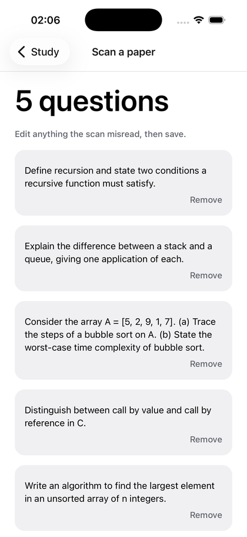
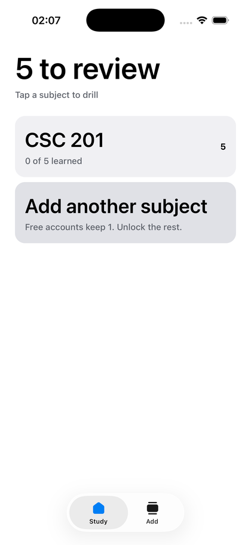
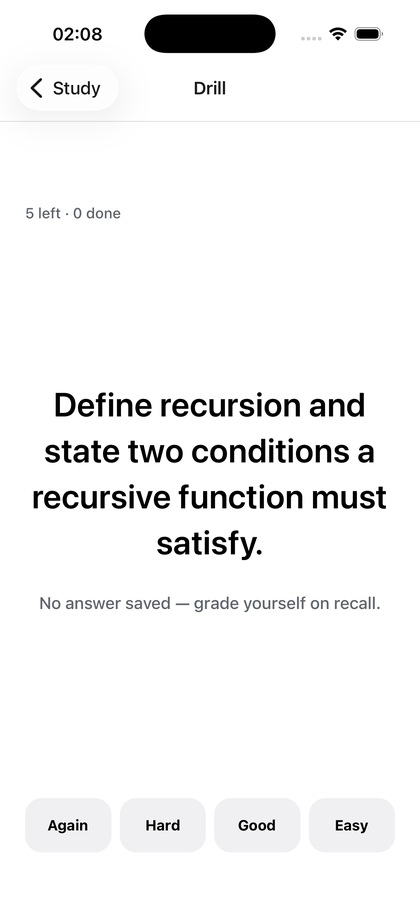

# PastQ

Photograph a past question paper, get drillable questions, revise them on a
schedule that puts the ones you keep forgetting in front of you more often.

Built for [RevenueCat Shipaton 2026](https://www.shipaton.com) (Next Gen).

| Scan a paper | What's due | Drill |
| --- | --- | --- |
|  |  |  |

## Why past questions

Nigerian students don't say "past papers", they say **past questions**. It's
the phrase they search for, the thing they buy photocopied outside the gate,
and the thing they revise from — because examiners reuse them.

The problem isn't finding past questions. It's that revising from a stack of
photocopies means reading the same page over and over, remembering the ones
you already know, and running out of time before you reach the ones you don't.

PastQ turns the paper into cards and decides what you see next.

## What it does

1. **Scan.** Photograph a paper. On-device text recognition reads it — Apple
   Vision on iOS, Google ML Kit on Android. Nothing leaves the phone.
2. **Parse.** Numbered questions get pulled out; the university header, the
   instructions, the marks and "Page 1 of 2" get thrown away. Sub-parts stay
   attached to their parent, because "Trace the steps of a bubble sort on A"
   means nothing without the array it refers to.
3. **Review.** You see what it found as editable text before anything saves.
   OCR is confident and wrong often enough that this step isn't optional.
4. **Drill.** Reveal, then grade yourself Again, Hard, Good or Easy. What you
   miss comes back in the same session. What you know comes back in days,
   then weeks.

Free accounts keep one subject. Paying unlocks as many as you're actually
sitting.

## How the scheduling works

Derived from SM-2, cut down to four grades. Every card carries an interval, an
ease factor, and a count of reps and lapses.

| Grade | What happens |
| --- | --- |
| Again | Interval resets to zero, ease drops, a lapse is recorded. The card returns before the session ends. |
| Hard | Advances, but more slowly than Good, and ease drops slightly. |
| Good | Advances on the card's own ease. First correct answer is one day, then three, then ease-multiplied. |
| Easy | Same, with ease rising. |

Ease never falls below 1.3, and intervals cap at a year, so a card can't get
stuck unreachable or come back so often it becomes noise.

The scheduling is pure functions in [`src/lib/srs.ts`](src/lib/srs.ts) with no
database and no device behind them, so it's tested directly:

```bash
npm test
```

## Running it

You need Node 20+, Xcode (iOS) or Android Studio, and a development build —
the OCR and purchase modules are native, so Expo Go won't run this.

```bash
npm install
npx expo run:ios      # or: npx expo run:android
```

To make purchases work, copy `.env.example` to `.env` and fill in your
RevenueCat public SDK keys. Without them the app runs normally and the paywall
says purchases aren't set up, rather than crashing.

## Layout

```
src/lib/srs.ts           scheduling, pure, tested
src/lib/parse-paper.ts   OCR lines -> questions, pure, tested
src/lib/ocr.ts           text recognition, wrapped so failures are legible
src/lib/db.ts            schema and versioned migrations
src/lib/queries.ts       subjects, questions, the due queue
src/lib/entitlements.ts  RevenueCat, failing closed to the free tier
src/app/                 screens (expo-router)
scripts/make-icons.py    regenerates the icon set
```

## A few decisions worth explaining

**A question can't exist without a place in the queue.** `createQuestion`
writes the question and its review row in one transaction. There's no path
where a saved question is invisible to the drill.

**Entitlements fail closed.** If RevenueCat can't be reached, the app treats
you as a free user. Failing open would mean the paywall stops meaning anything
the first time the network drops.

**The core is pure.** Scheduling and parsing are the two places a bug would be
silent — a bad interval doesn't crash, it just teaches you badly. Both are
ordinary functions with tests, separate from anything native.

## Licence

MIT. See [LICENSE](LICENSE).
